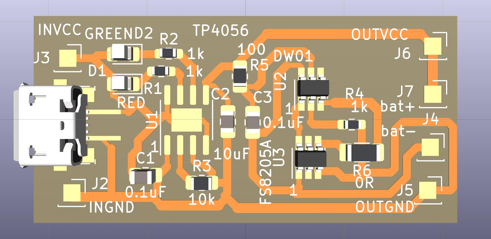
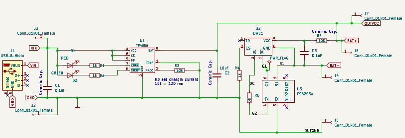
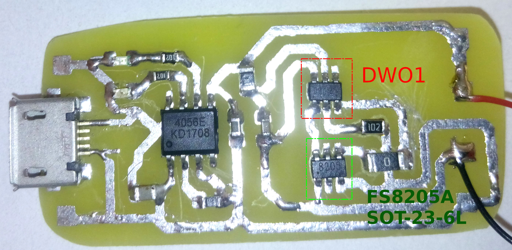
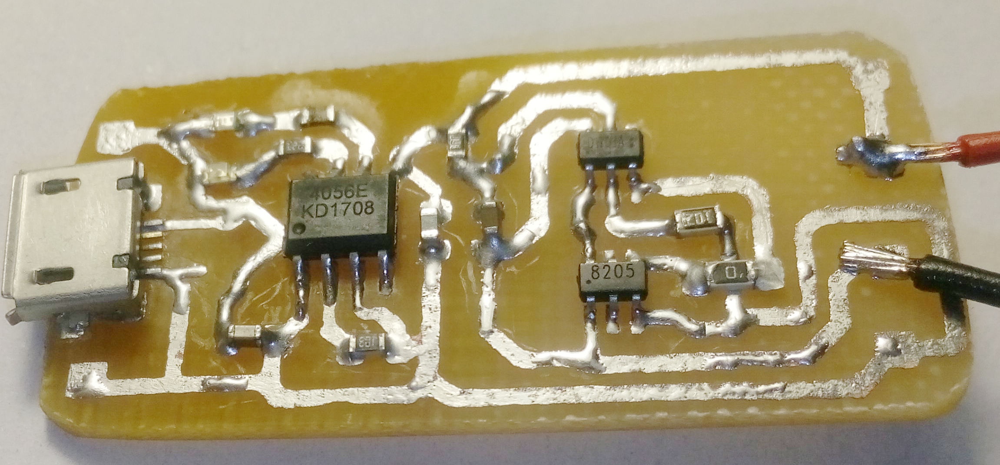

# tp4056
TP4056 charger kicad schematics

Kicad version with tp4056 footprint and schematics

TP4056 battery charging module with protection.  KICAD v6. old version for KICAD v5.

Charging current set to 130ma (R=10kOm)

tp4056 for DIY hand soldering with microUSB.
